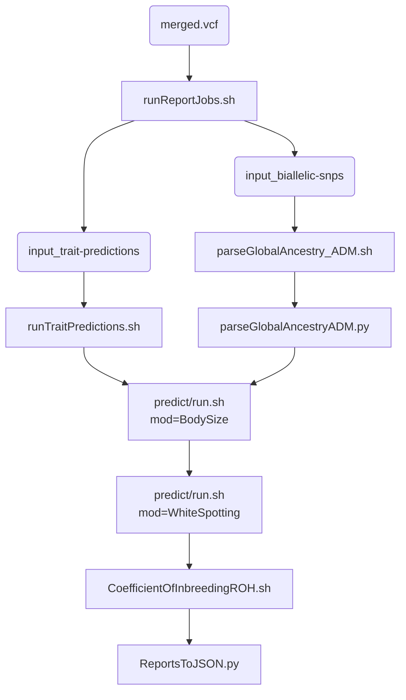

## Software
plink2/dev PLINK2 Alpha 3.6 final (14 Aug) https://www.cog-genomics.org/plink/2.0/
'docker://quay.io/biocontainers/plink2:2.00a3.3--hb2a7ceb_0'
plink2/current/plink is actually PLINK1.9… Stable (beta 6.26, 2 Apr) https://www.cog-genomics.org/plink/1.9/
'docker://quay.io/biocontainers/plink:1.90b6.21--hec16e2b_2'
admixture is linux-1.3.0 https://dalexander.github.io/admixture/download.html
docker://quay.io/biocontainers/admixture:1.3.0--0
allel is 1.2.1 https://scikit-allel.readthedocs.io/en/stable/
R is 3.5.0 for predict.r, and have the following packages;
tidyverse
data.table
caret
randomForest
scales
stringr

## `CoefficientOfInbreedingROH.sh`
- Run plink, $input to $input.ROH
- $input.ROH.COI.csv is produced from $input.ROH.hom.indiv

## `GenoToPhenoNew.py`
- python script to extract genotypes and predict phenotypes
- takes input.vcf.gz
- variances from bin/DAG\_VariantsOfInterest.csv
- set imputation panel, refernece genome and filepath and prefix
- output: $output\_genotypeTable.csv, \_pheotypeTable.csv,
\_trailblazerGenotypeTable.csv, \_jsonTable.csv

## `GlobalAncestry_ADM.sh`
- lots of dependencies
- plink2/dev input and ref -> bed file of GlobalAncestrySNPS
- plink to refMerge
- awk/sed to generate pop file
- admixture for supervised ancestry inference
- awk to label Q file
- python parseGlobalAncestryADM.py with fam and labeled file

## `parseGlobalAncestryADM.py`
- generate GA estimates full results .csv and .json

## `predictReportsToJSON.py`

## `reportSubmitJSON.sh`
- run push to webhook

## `runReportJobs.sh`
- get merged vcf files
- plink2 dev for biallelic and trait predictions
- call parseGlobalAncestryADM.py
- call runTraitPredictions.sh
- call predict/run.sh (with BodySize then WhiteSpotting)
- call CoefficientOfInbreedingROH.sh
- run ReportsToJSON

## `runTraitPredictions.sh`
- call GenoToPhenoNew.py

